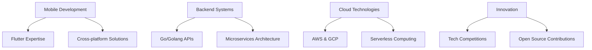

# 👋 Hello World, I'm Muhammad Usama

<div align="center">
  
</div>

<div align="center">
  
  [](https://github.com/muhammadusamahoyrr)
  [](https://github.com/muhammadusamahoyrr)
  [](https://github.com/muhammadusamahoyrr)
  
</div>

---

## 🚀 About Me

> **"Making an attempt to sever the fate of this world through code."**

I'm a passionate **Software Engineer** and **Mobile Development Lead** based in **Islamabad, Pakistan** 🇵🇰. With a strong foundation in both **mobile** and **backend development**, I love creating innovative solutions that make a real impact.

```typescript
const usama = {
  code: ["Dart", "Flutter", "Go", "Python", "JavaScript", "C++"],
  askMeAbout: ["Mobile Development", "Backend Systems", "Tech Innovation", "Football", "Life"],
  technologies: {
    mobile: ["Flutter", "Firebase", "FCM"],
    backend: ["Go", "AWS", "GCP", "Redis"],
    databases: ["MongoDB", "PostgreSQL", "Firebase"],
    devOps: ["Docker", "Kubernetes", "AWS", "GCP"],
    tools: ["Git", "Postman", "VS Code", "Android Studio"]
  },
  architecture: ["Microservices", "Event-Driven", "Serverless", "Progressive Web Apps"],
  currentFocus: "Building scalable mobile applications and distributed systems",
  funFact: "I debug with console.log and I'm not ashamed! 😄"
};
```

---

## 🏆 Achievements & Recognition

<div align="center">

### 🥇 **Competition Victories**
  
🏆 **First Position** - Huawei ICT Innovation Competition'25, Global Finals, Shenzhen, China  
🏆 **First Position** - Huawei ICT Innovation Competition'24, Regional Finals, Riyadh, Saudi Arabia  
🏆 **Winner** - Visio Spark'24  
🇵🇰 **Represented Pakistan** - Huawei Seeds for the Future'24, Tashkent, Uzbekistan  
🥈 **First Runner-up** - Softec'24 - Mobile App Development  

</div>

---

## 💼 Professional Experience

### 🏢 **Software Engineer @ Hareseca LLC**
*Leading innovative projects and delivering scalable solutions*

### 👑 **Mobile Development Lead @ YESIST12**
*Spearheading mobile development initiatives and team leadership*

### 🎓 **Tech Educator & Speaker**
*Teaching: Dart, Flutter, Go (Golang), Mobile & Backend Development, Software Engineering, Data Structures and Algorithms, OOP, Mobile App Development*

---

## 🛠️ Tech Arsenal

<div align="center">

### **Languages & Frameworks**


### **Cloud & DevOps**


### **Databases & Tools**


</div>

---

## 📊 GitHub Analytics

<div align="center">
  
  
  
  
</div>

<div align="center">
  
  [](https://git.io/streak-stats)
  
</div>

<div align="center">
  
  
  
</div>

---

## 🎯 Current Focus

<div align="center">



</div>

- 🔭 **Currently working on:** Advanced Flutter applications and Go-based microservices
- 🌱 **Learning:** Advanced cloud architecture patterns and AI/ML integration
- 👯 **Looking to collaborate on:** Open source projects and innovative mobile solutions
- 🤔 **Looking for help with:** Scaling distributed systems and performance optimization
- 💬 **Ask me about:** Flutter, Go, Mobile Architecture, Backend Systems, and Tech Career Growth

---

## 📝 Latest Articles & Insights

### 📖 **Medium Articles**
- 🔥 [FlutterFire Push Notifications via FCM](https://medium.com/@usamaexe)
- 📱 *More tech insights coming soon...*

---

## 🌐 Let's Connect

<div align="center">

[](https://linkedin.com/in/usamaexe)
[](https://twitter.com/Usamas_exe)
[](https://medium.com/@usamaexe)
[](mailto:muahmad710@gmail.com)
[](https://instagram.com/usamas.exe)

**💼 Business Inquiries:** [muahmad710@gmail.com](mailto:muahmad710@gmail.com)

</div>

---

## 🎮 Life Progress

<div align="center">

**Life Achievements Unlocked:**
- [x] 🎂 Born
- [x] 💼 Get a job
- [x] 🏆 Win international competitions
- [ ] 💍 Get Married
- [ ] 👶 Have children
- [ ] 🌟 Change the world through code

</div>

---

## 💡 Fun Facts

- 🏈 **Football enthusiast** - Always up for a match discussion!
- 💻 **Code philosophy:** "Clean code is not written by following a set of rules. You don't become a software craftsman by learning a list of heuristics. Professionalism and craftsmanship come from values that drive disciplines."
- 🌍 **Dream:** Building technology that makes a positive impact on millions of lives
- ☕ **Fuel:** Coffee and curiosity
- 🎯 **Goal:** To bridge the gap between innovative ideas and practical solutions

---

<div align="center">

### 🚀 **"Code is poetry written in logic"**

*Thank you for visiting my profile! Feel free to explore my repositories and don't hesitate to reach out if you want to collaborate on something amazing!* ⭐


</div>

---

<div align="center">
  
</div>
